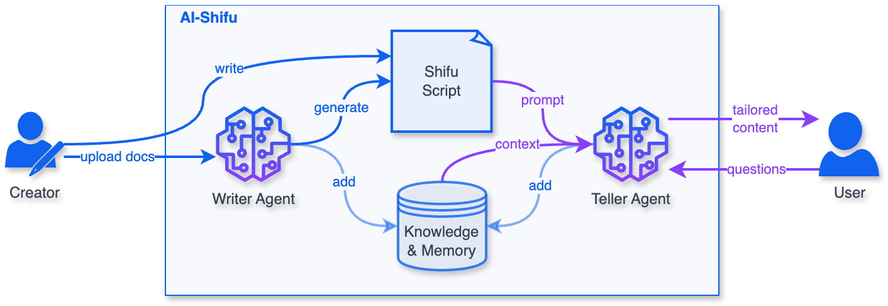

<div align="center">
  </img>
<p><strong>Everything you see is tailored just for you</strong></p>

English | [简体中文](README_ZH-CN.md)

</div>

AI-Shifu serves as a teacher, broadcaster, storyteller, and guide... As an AI-driven narrator, AI-Shifu can present any textual content to each user in a fully personalized way, creating an unprecedented reading experience.

<div align="center">
  
</div>

# Features

1. **Personalized Output**: Fully personalized content output based on user's identity, background, interests and preferences, comparable to one-on-one human interaction.
2. **Rich Media**: Supports multiple content formats including Markdown, HTML, Mermaid diagrams, as well as embedded images and videos.
3. **Content Safety**: Master scripts control all output to reduce hallucinations and ensure content quality.
4. **Q & A**: Users can ask questions at any time to get contextually relevant intelligent answers.
5. **Interactive**: Ask questions to users at any time, driving subsequent processes based on user responses.
6. **Script Editor**: Easily edit scripts and preview effects.

# Roadmap

- [ ] Overall refactoring
- [ ] Writing AI agent for rapid script generation and maintenance
- [ ] Knowledge base
- [ ] Speech input and output

# Using AI-Shifu

## Platform

[AI-Shifu.com](https://ai-shifu.com) is an education platform powered by AI-Shifu. You can try it and learn the AI-guided courses developed by human experts.

## Self-hosting

> For source code installation, please refer to the [Installation Manual](INSTALL_MANUAL.md)

Make sure your machine has installed [Docker](https://docs.docker.com/get-docker/) and [Docker Compose](https://docs.docker.com/compose/install/).

### Using Docker Hub image

```bash
git clone https://github.com/ai-shifu/ai-shifu.git
cd ai-shifu/docker
cp .env.example .env
# Modify the configuration in the .env file. At least one LLM access key should be configured, and set DEFAULT_LLM_MODEL to the name of the model
docker compose up -d
```

### Building from source code

```bash
git clone https://github.com/ai-shifu/ai-shifu.git
cd ai-shifu/docker
cp .env.example .env
# Modify the configuration in the .env file. At least one LLM access key should be configured, and set DEFAULT_LLM_MODEL to the name of the model
./dev_in_docker.sh
```

### Access

After Docker starts:
1. Open `http://localhost:8080` in your browser to access the user interface
2. Open `http://localhost:8081` in your browser to access the script editor
3. Use any phone number for login; the default universal verification code is **1024** (for demo/testing only — change or disable in production)
