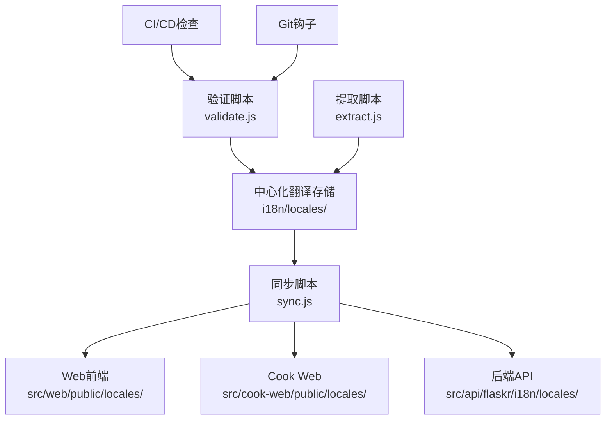

# AI-Shifu 统一国际化系统实施指南

这份文档详细说明了AI-Shifu项目统一国际化系统的完整实施方案和使用指南。

## 📋 系统概览

### 实施目标
- ✅ **统一数据格式**：所有组件使用相同的JSON嵌套结构
- ✅ **中心化管理**：单一数据源，自动同步到各组件
- ✅ **质量保证**：JSON Schema验证和自动化检查
- ✅ **向后兼容**：保持现有API不变，平滑迁移
- ✅ **开发工具**：完整的工具链支持

### 架构设计



## 🗂️ 目录结构

```text
i18n/                          # 统一国际化系统根目录
├── README.md                  # 系统说明文档
├── package.json               # 依赖管理
├── locales/                   # 中心化翻译文件
│   ├── en-US.json            # 英文翻译（主要语言）
│   ├── zh-CN.json            # 中文翻译
│   └── languages.json        # 支持的语言配置
├── schemas/                   # 验证规则
│   └── translation-schema.json  # JSON Schema定义
├── scripts/                   # 工具脚本
│   ├── extract.js            # 翻译提取和合并
│   ├── sync.js               # 多组件同步
│   ├── validate.js           # 完整性验证
│   ├── frontend-config.js    # 前端配置生成
│   ├── update-frontend-configs.js  # 前端配置更新
│   ├── pre-commit-hook.sh    # Git预提交钩子
│   └── install-hooks.js      # Git钩子安装
└── docs/                      # 文档
    ├── naming-convention.md   # 命名规范
    └── implementation-guide.md  # 本实施指南
```

## 🚀 快速开始

### 1. 系统初始化

```bash
# 安装依赖
cd i18n
npm install

# 提取现有翻译并合并
node scripts/extract.js

# 同步到各组件
node scripts/sync.js

# 验证翻译完整性
node scripts/validate.js
```

### 2. 安装Git钩子（推荐）

```bash
# 安装自动验证钩子
node i18n/scripts/install-hooks.js

# 现在每次提交时会自动验证翻译文件
```

### 3. 更新前端配置

```bash
# 标准化前端i18n配置
node i18n/scripts/update-frontend-configs.js

# 安装缺失的依赖包（如果提示需要）
cd src/web && npm install i18next-browser-languagedetector
cd ../cook-web && npm install i18next i18next-browser-languagedetector
```

## 📦 各组件集成

### 后端API (Flask)

**自动加载机制**：
```python
# 后端现在自动优先加载JSON格式翻译
from flaskr.i18n import load_translations

# 应用启动时
load_translations(app)  # 自动尝试JSON格式，回退到Python格式
```

**使用方式**：
```python
# 原有方式（仍然支持）
from flaskr.i18n import _
message = _('USER.LOGIN.TITLE')

# 新的增强方式
from flaskr.i18n import t
message = t('user.login.title')  # 支持小驼峰命名
message = t('common.greeting', name='用户')  # 支持变量插值
```

### Web前端 (React)

**配置文件**：`src/web/src/i18n.ts`
```typescript
import { useTranslation } from 'react-i18next';

function MyComponent() {
  const { t } = useTranslation();

  return (
    <div>
      <h1>{t('user.login.title')}</h1>
      <p>{t('common.greeting', { name: 'User' })}</p>
    </div>
  );
}
```

### Cook Web (Next.js)

**配置文件**：`src/cook-web/src/i18n.ts`
```typescript
'use client';
import { useTranslation } from 'react-i18next';

function MyComponent() {
  const { t } = useTranslation();

  return (
    <div>
      <h1>{t('auth.login.title')}</h1>
      <button>{t('common.submit')}</button>
    </div>
  );
}
```

## 🔧 开发工作流

### 日常开发

1. **添加新翻译**：
   ```bash
   # 编辑中心化翻译文件
   vim i18n/locales/zh-CN.json  # 添加中文翻译
   vim i18n/locales/en-US.json  # 添加英文翻译

   # 同步到各组件
   node i18n/scripts/sync.js
   ```

2. **验证翻译**：
   ```bash
   # 手动验证
   node i18n/scripts/validate.js

   # 自动验证（如果安装了Git钩子）
   git commit -m "feat: add new translation keys"
   ```

3. **更新现有翻译**：
   ```bash
   # 重新提取所有翻译
   node i18n/scripts/extract.js

   # 强制同步到所有组件
   node i18n/scripts/sync.js --force
   ```

### 修改翻译键结构

```bash
# 1. 编辑中心化翻译文件
# 2. 重新同步
node i18n/scripts/sync.js --force

# 3. 验证无错误
node i18n/scripts/validate.js

# 4. 重启开发服务器测试
```

## 📋 命名规范

### 键名规范
- 使用小驼峰命名：`user.loginForm.title`
- 按功能模块分组：`auth.login.*`、`common.*`
- 避免过深嵌套（≤3层）

### 模块分类
```json
{
  "common": "通用组件和消息",
  "auth": "认证相关",
  "user": "用户管理",
  "chat": "聊天功能",
  "navigation": "导航菜单",
  "error": "错误信息",
  "settings": "设置页面"
}
```

### 变量插值
```json
{
  "welcome": "欢迎 {{name}}！",
  "itemsCount": "共 {{count}} 个项目",
  "timeRemaining": "剩余 {{minutes}} 分钟"
}
```

## ⚙️ 配置选项

### 同步脚本选项

```bash
node i18n/scripts/sync.js --help

选项:
  --force          强制更新所有文件
  --validate       同步后运行验证
  --ignore-issues  忽略目标路径问题
  --backup         创建备份文件
```

### 验证脚本功能

- ✅ JSON Schema格式验证
- ✅ 翻译键一致性检查
- ✅ 命名规范验证
- ✅ 变量插值格式检查
- ✅ 空值和类型检查

## 🔍 CI/CD集成

### GitHub Actions

系统自动创建了 `.github/workflows/i18n-validation.yml` 工作流：

- **翻译文件验证**：检查JSON格式和结构
- **一致性检查**：确保所有语言具有相同的键
- **同步状态检查**：验证翻译文件是否已同步
- **硬编码字符串扫描**：发现潜在的未翻译文本
- **兼容性检查**：验证前后端配置正确性

### 本地Git钩子

```bash
# 安装预提交钩子
node i18n/scripts/install-hooks.js

# 钩子功能：
# - 翻译文件验证
# - 同步状态检查
# - 硬编码字符串检查
# - 提交信息格式验证
```

## 🚨 故障排除

### 常见问题

1. **验证失败**：
   ```bash
   # 检查详细错误
   node i18n/scripts/validate.js

   # 常见原因：
   # - 翻译键不一致
   # - JSON格式错误
   # - 变量插值格式问题
   ```

2. **同步失败**：
   ```bash
   # 检查目标目录是否存在
   ls src/web/public/locales/
   ls src/cook-web/public/locales/
   ls src/api/flaskr/i18n/locales/

   # 强制重新创建
   node i18n/scripts/sync.js --force
   ```

3. **前端配置问题**：
   ```bash
   # 重新生成配置
   node i18n/scripts/update-frontend-configs.js

   # 安装缺失依赖
   npm install i18next-browser-languagedetector
   ```

### 调试技巧

```bash
# 生成翻译统计
node -e "
const { extractAllTranslations } = require('./i18n/scripts/extract.js');
const translations = extractAllTranslations();
console.log('翻译统计:',
  Object.entries(translations).map(([lang, data]) =>
    \`\${lang}: \${Object.keys(data).length} keys\`
  )
);
"

# 检查特定翻译键
grep -r "specific.key" i18n/locales/

# 验证JSON格式
python -m json.tool i18n/locales/zh-CN.json > /dev/null
```

## 📊 系统监控

### 翻译覆盖率

```bash
# 检查翻译完整性
node i18n/scripts/validate.js | grep "缺少翻译键"

# 统计翻译数量
find i18n/locales -name "*.json" -not -name "languages.json" -exec wc -l {} \;
```

### 性能监控

- 翻译文件大小监控
- 加载时间分析
- 缓存效率统计

## 🔄 维护计划

### 定期任务

1. **每周**：运行 `node i18n/scripts/validate.js` 检查完整性
2. **每月**：清理未使用的翻译键
3. **版本发布前**：运行完整的提取和同步流程

### 升级路径

1. **短期**：优化验证性能，添加更多检查规则
2. **中期**：集成翻译管理平台，支持实时协作
3. **长期**：AI驱动的翻译建议和自动化

## 💡 最佳实践

### 开发建议

1. **翻译键设计**：
   - 使用描述性命名
   - 按功能模块组织
   - 避免过度嵌套

2. **内容管理**：
   - 定期清理无用翻译
   - 保持英文为主要语言
   - 使用变量而非字符串拼接

3. **团队协作**：
   - 统一使用Git钩子
   - 定期同步翻译文件
   - 代码审查时关注翻译使用

### 性能优化

1. **前端优化**：
   - 启用翻译缓存
   - 使用懒加载
   - 合理设置语言检测优先级

2. **后端优化**：
   - 翻译文件预加载
   - 内存缓存优化
   - 支持热重载

## 📞 支持与反馈

如遇到问题或有改进建议，请：

1. 查看本文档和 `i18n/README.md`
2. 运行相关诊断脚本
3. 创建GitHub Issue或联系团队
4. 查看CI/CD工作流输出

---

**祝使用愉快！** 🌍✨
